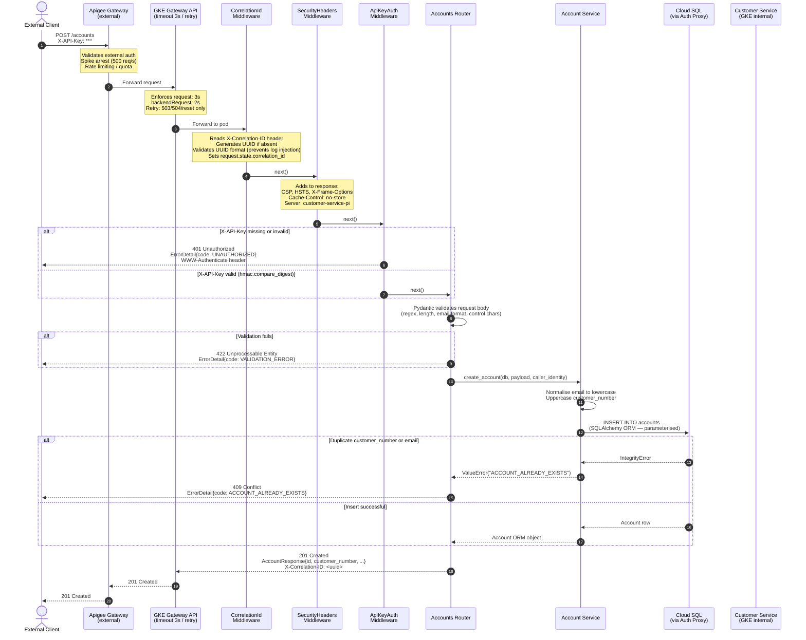
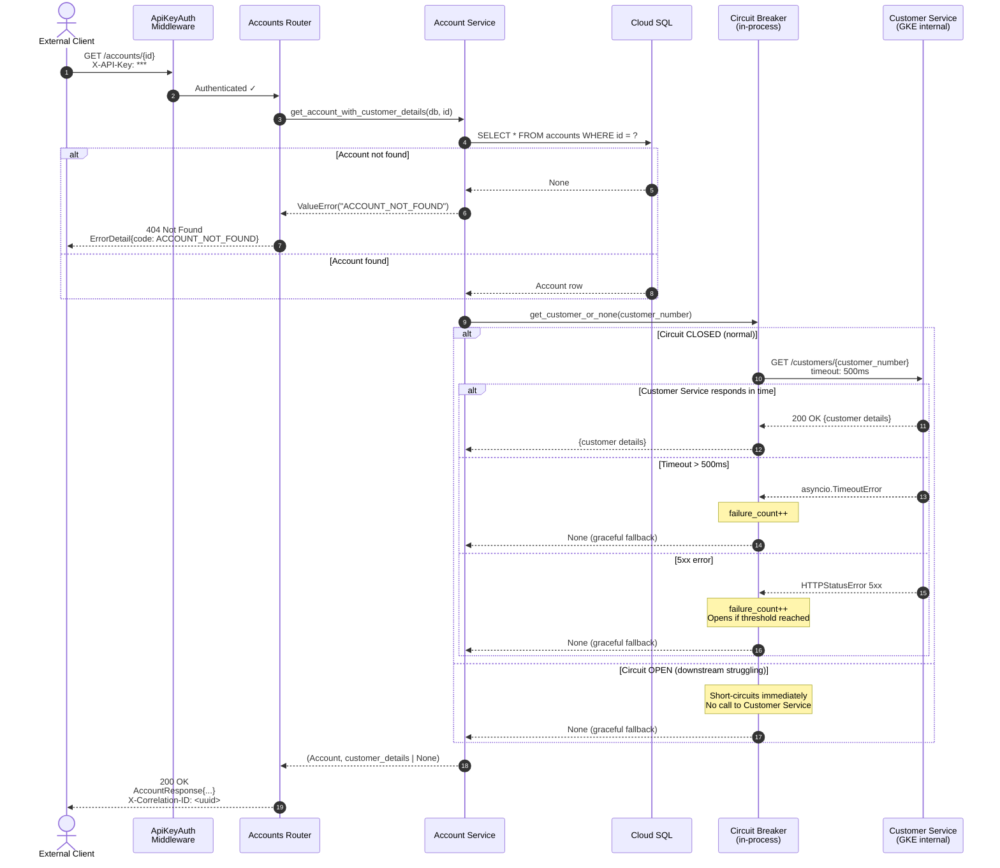
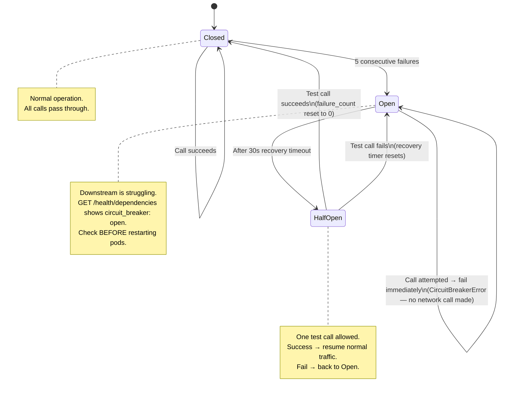
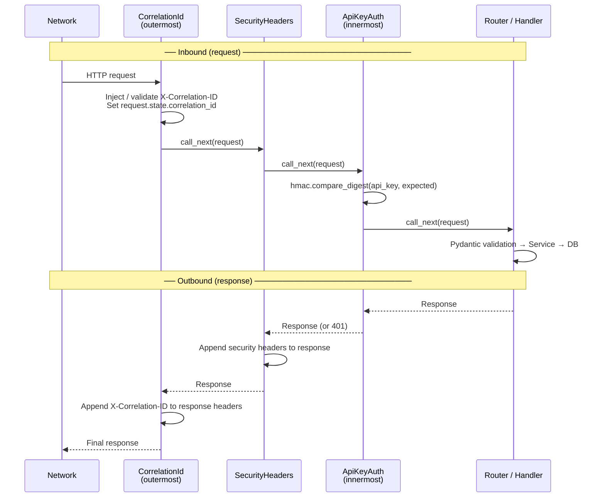
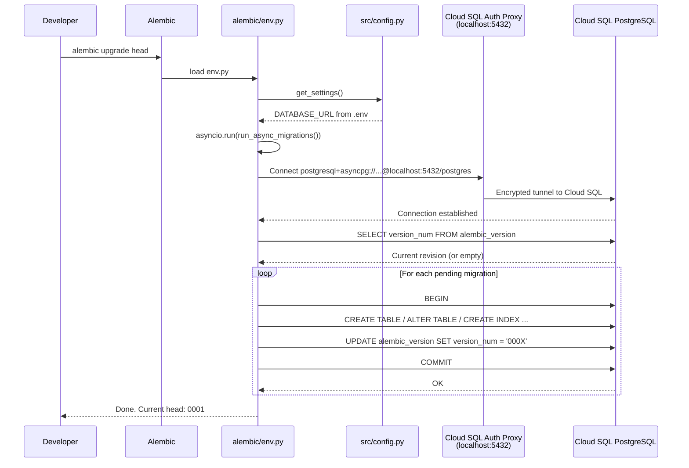
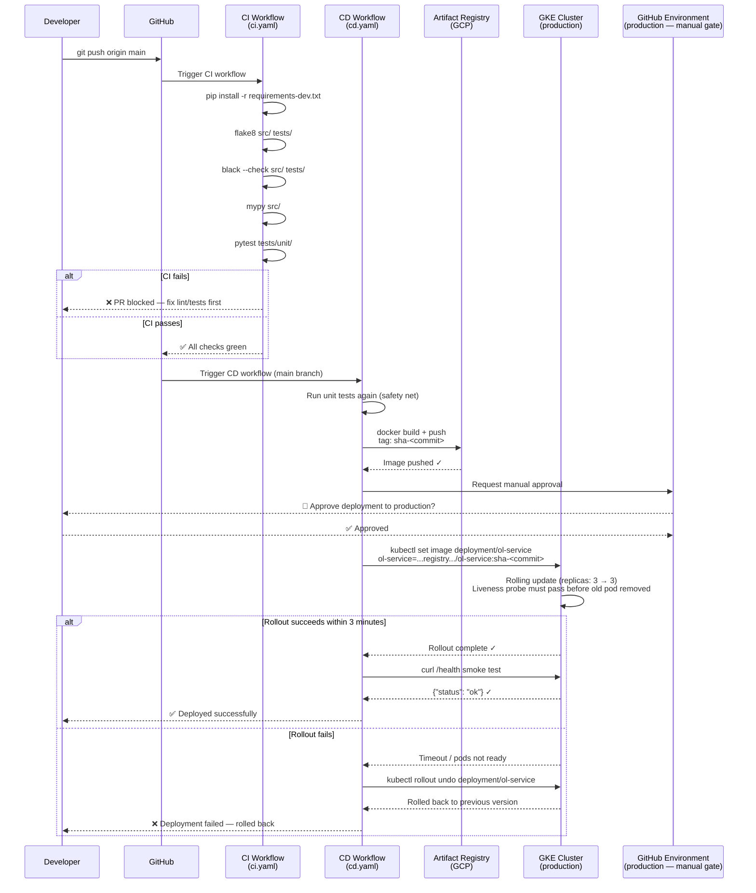

# Sequence Diagrams — Customer Service Pi

---

## 1. Full Request Flow (Happy Path)

Shows a `POST /accounts` request travelling through every layer from the external client to the database.

---

## 2. GET /accounts/{id} with Customer Enrichment

Shows how the service attempts to enrich the account response with data from the downstream Customer Service, and degrades gracefully when it is unavailable.

---

## 3. Circuit Breaker State Machine

---

## 4. Middleware Execution Order

Middleware is added to FastAPI in reverse execution order (last added = outermost).

---

## 5. Database Migration Flow

---

## 6. CI/CD Pipeline Flow

